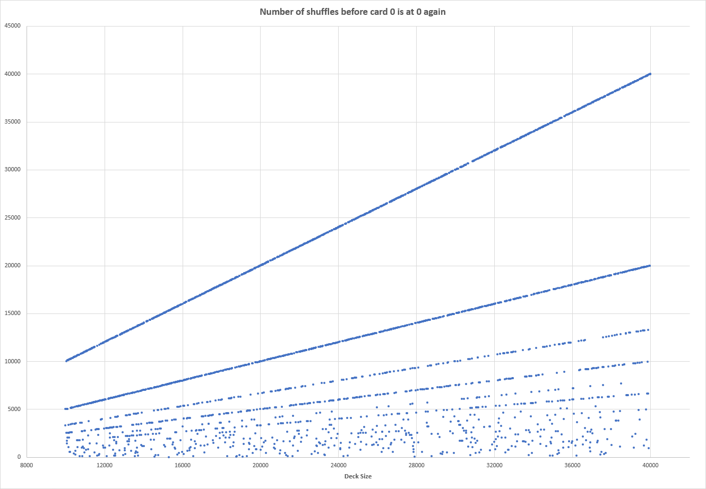
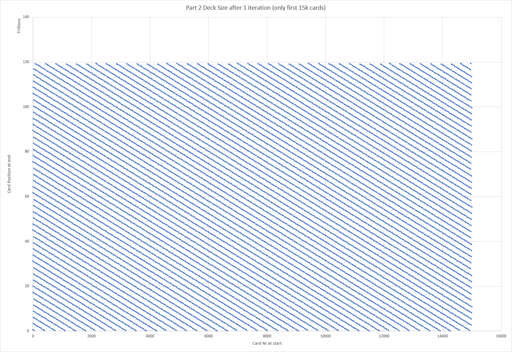

# Day 22 Notes (esp. part 2)

Some notes about part 2 specifically, hoping that writing them down helps me find a solution.

## General remarks

- The deck size and number of shuffles are both (largeish) prime numbers (crypto?)
- So is 10007 (a prime), the deck size in part 1
- Deck size and number of shuffles both have the same number of digits
- The part 2 challenge is subtly different from part 1, in that it asks not about where a starting card _ends_ up, but the other way around: where a card in specific end position _came from_
- The numbers are plainly too large to brute force this, no matter how optimized you get; there _must_ be a 'smart' solution
- Neither 2019, 2020, nor 2939 is a prime number
- If you shuffle the 10007 sized deck exactly 10007 times, it goes back to its original state
- The part 2 solution where we calculate backwards works for part 1, and would work for part 2 if there was enough time to brute force
- Card 2020 ends up in its place, being pulled out from some enormously high position just before that
- Going back a few 1000 shuffles from the final one, "card 2020" sits "all over the place"
- The "working backwards" solution required the inverse modulus operation, which is quite esoteric and on a meta-level it might be a dead end because the AoC creator would take pity on languages where that would be extra hard to do?
- The "cut" operations in my input are of near-meaningless size, relative to the deck size
- Shuffling N times where N is a prime might be meaningful?

## Presumed answer directions

At this moment I was and/or am guessing the solution is one of these:

- **Input** causes a predictable effect each full shuffle
- **Pattern** in how "card 2020" roams through positions in the deck
- **Pattern** from visualizing position of "card 202" or the part 1 solution
- **Higher order pattern**, e.g. meaning in the difference in position between shuffles
- **Crypto** has the answer (read up on public/private key encryption & large primes)
- **Puzzle text** might contain a subtle but strong hint that I've missed
- **Solve for part 1** might help solve part 2

## Assumptions

Some assumptions so far:

- It's only _the position of a single card_ that matters, not keeping track of the entire deck
- This is why the way part 2 is asked makes going backwards logical
- Brute force won't work in any feasible way, perhaps not even if the entire shuffle becomes just 1 operation
- The "right" solution will run in under 10 seconds, likely in a lot less than 1 second

## Current Direction

Suppose a deck of size `N`, where N is a prime over `1e5`.
After `i` shuffles the card in position `0` is again in position `0`.
There seems to be a formula:

```none
(N-1) = ? * i
```

Where `?` seems to be a positive integer number.

For `N` between `1e5` and `2e5` the `?` is one of `[1, 2, 3, 4, 5, 6, 7, 8, 9, 10, 11, 12, 13, 14, 15, 16, 17, 18, 19, 20, 21, 22, 23, 24, 25, 26, 28, 29, 30, 33, 34, 35, 36, 38, 39, 40, 42, 43, 44, 46, 48, 49, 50, 52, 53, 56, 60, 62, 64, 66, 68, 70, 71, 74, 75, 77, 81, 82, 84, 85, 86, 88, 89, 90, 91, 96, 103, 106, 111, 128, 132, 136, 144, 146, 168, 176, 193, 194, 212, 232, 244, 248, 260, 262, 274, 278, 450, 477, 1042, 3828]`. There seems to be no logic behind that series.

If we plot `i` versus `N` there _is_ a clear pattern emerging:



Then there is the effect of the full 50-instruction shuffle on the huge part 2 deck.
Here's a plot of the first 15k cards from the "factory order" deck, and what position they end up in:



This seems to be on to something.
A shuffle creates "gaps" between cards of certain size.
The gap is constant between consecutive cards.

E.g. suppose a deck with cards `0, 1, 2, 3, ...`.
After one complete shuffle (puzzle input) the number of cards _between_ `0` and `1` will be equal to the number of cards between `1` and `2`, and so on.

Now to see how this can be used to calculate the final answer...

## Final notes

Hoping to stay spoiler-free _and_ be able to solve this on my own.
